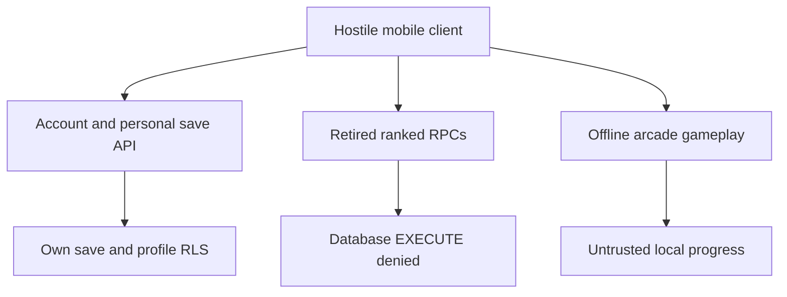

# Ranked containment: phase 1

## Objective

Close the demonstrated direct-RPC score forgery before implementing deterministic
replay. The old protocol accepted ordered checkpoints without evidence of play.
Hiding a button, adding client HMAC, trusting timestamps, or encrypting local
scores cannot repair this boundary.

## Architecture and trust boundary

Accounts and non-economic personal saves retain their reviewed activation gate.
Ranked methods return disabled results even with a signed-in player and a stale
configuration claiming `rankedEnabled:true`. Historical leaderboard UI has no
network handler. The protocol source remains solely for historical unit tests;
it is absent from the shipped app and service-worker precache. A new cache name
retires the old precache after installation/activation. Old installed clients
are contained by database authorization after the migration is applied.

## Rules and prohibitions

* Revoke EXECUTE on all three legacy functions, all three v2 functions, and
  `get_leaderboard` from PUBLIC, anon, authenticated, and service_role. Revoking
  PUBLIC is necessary because PostgreSQL privileges are inherited.
* Preserve historical data and definitions; do not delete evidence. Database
  owners remain trusted administrators and can execute functions.
* Keep ranked/economy writes unavailable to players. Local coins, cosmetics and
  personal bests remain untrusted offline progress. No cloud save mints currency.
* Never migrate old `verified_rounds` into a replay-accepted score table.
* Do not restore old grants as a rollback or ship a client secret.

## Implementation

`supabase/migrations/20260930210000_ranked_containment.sql` performs additive
revocations and annotates historical data. Existing migrations are unchanged.
`src/cloud/account.js` keeps a disabled compatibility interface for the current
classic-script gameplay. This avoids mixing a mechanical ES-module migration
with urgent authorization containment.

`scripts/build.mjs` generates `rankedEnabled:false`, rejects explicit ranked
activation and removes the retired protocol asset. `index.html` and
`service-worker.js` no longer load/cache it. CI now tests proposal branch pushes,
since PRs created using GITHUB_TOKEN suppress new pull_request-triggered runs.
Permissions remain read-only by default; deployment remains main-only.

## Tests and evidence

* pgTAP checks privileges and actual denial of seven functions under anon,
  authenticated and service_role, player write denial, no scripted mutations,
  retained profile behavior and existing cross-account isolation.
* Build tests assert independent cloud activation, activation refusal and no
  protocol asset in the distribution or precache.
* Browser tests exercise account sync with a malicious/stale ranked config,
  disabled ranked methods, no ranked requests, hidden leaderboard, safe text
  rendering and refresh/sign-out races. Historical protocol unit tests only
  establish transport properties, never anti-cheat assurance.
* Local static validation and 29 Node tests passed on the implementation branch.
  Database, browser and native build results must be obtained from CI; this
  document does not claim hosted migration deployment or native-device evidence.

## Deployment and acceptance gate

Review the bot-authored PR and require Security baseline, Database authorization,
Web quality, Android debug and release builds, iOS simulator build and their
aggregate gate on the exact final commit. Merge remains an owner action.

Apply migrations through the existing controlled Supabase release process;
`supabase db push` requires the separately configured target and authorized
credentials. No hosted deployment is performed by this patch. Verify the
migration ledger and catalog privileges, then call each retired endpoint using
real disposable player credentials and confirm denial, including an old app.
Confirm personal saves still work and no old ranked data is exposed by alternate
views/GraphQL/Realtime. Roll back app UI if necessary while retaining revocations;
repair authorization with a forward migration. Never grant legacy RPC access.

## Next phase: replay-backed ranked service

PR #33 has been merged into main and is preserved as an offline gameplay replay
POC. It does not activate public ranked scoring. Extract
all production physics, collision order, PRNG use and scoring into a versioned,
integer/fixed-point deterministic engine shared by frontend and worker. Freeze
per-tick input semantics and ruleset hashes; compare browser/server traces on
real captured games before making ranking claims.

Introduce new runs/telemetry/result tables rather than repurpose legacy accepted
counts. A server-only signing key authenticates immutable tickets bound to
verified Auth user, random run token, database start timestamp, seed, ruleset and
expiry. Clients return ticket bytes unchanged plus bounded complete chronological
inputs; coordinates are observations, never authoritative state. No client key.
The Edge ingress verifies Auth and ticket, payload bounds, expiry and exact
idempotency digest, then atomically stores telemetry and claims processing.
Duration is derived from database timestamps; simulated ticks cannot outrun the
elapsed server time. This constrains speed but does not prove human play.

A durable leased worker loads immutable telemetry and the pinned engine, replays
all ticks and writes accepted/rejected plus computed score in a fenced database
transaction. Crash/retry recovery, conflicting duplicates, queue bounds and
at-most-once rewards must pass concurrent database tests. Only accepted results
feed a new leaderboard. Synthetic valid input or bots can still pass replay;
rate limits, abuse review and operational monitoring remain necessary.

After replay gates, incrementally move state/gameplay/network to ES modules and
add maintained native secure session persistence. Browser tokens stay memory-only.
Native secure storage reduces at-rest exposure; XSS running in the app can still
invoke an authorized bridge or steal a live session. Strict CSP, local bundles,
output escaping and dependency review remain required. Complete ticket/worker,
secure-storage and entitlement implementation is a later phase, not delivered by
this containment PR.
