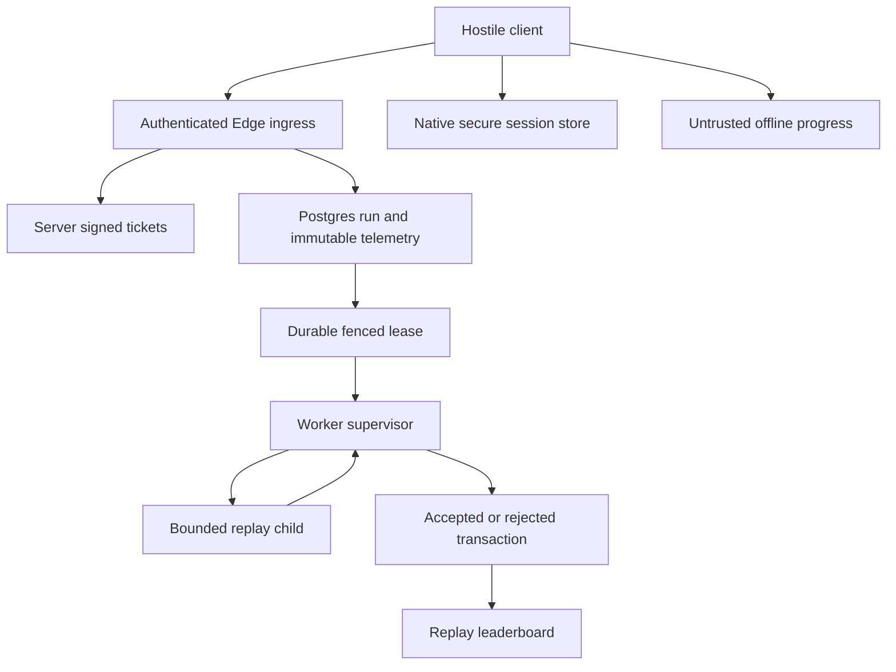

# Ranked service and secure-session implementation

## Objective

Turn the measured replay POC into durable, independently gated service surfaces,
while keeping the shipped guest game playable offline. This branch is a staging
candidate, not authorization to launch ranked play or grant purchase value.

## Architecture rules

The old checkpoint SQL remains revoked. New tables are `ranked_replay_runs`,
`ranked_telemetry`, and `ranked_rulesets`. No old score is imported. Access/refresh
tokens use the pinned Aparajita Capacitor 8 plugin on native devices; the web
path never imports the plugin's plaintext fallback and stays memory-only.
Secure storage protects persisted tokens at rest, not a live XSS-controlled app.

## Prohibitions

No client signing secret, score assignment, direct economy write, plaintext token
fallback, automatic PR merge, paid provider setup, real-device claim, or store
submission. Keep `rankedEnabled:false` and ruleset activation false until hosted
and physical-device acceptance. Game Center is not interchangeable with Sign in
with Apple; configure each chosen provider through its official integration.

## Implementation

* `start-ranked-run-v2` verifies identity with Supabase Auth. Postgres generates
  nonce, seed and absolute timestamps. Server-only HMAC signs the persisted
  binding, including user, run, seed, ruleset, viewport, key ID and expiry.
* `finish-ranked-run-v2` verifies signature, Auth owner and persisted binding.
  It bounds JSON wire bytes before parsing and validates consecutive input
  ticks, coordinate ranges and pause/resume lifecycle. Input coordinates are
  targets, not authoritative player positions. Matching retries retain one
  receipt; changed retries fail.
* Database receipt and immutable telemetry commit atomically. Duration is a
  generated column from server timestamps and must cover simulated steps.
  Per-user start quota, one active run and bounded queue limit intake.
* A supervisor claims a 30-second lease and sends data to a child with an empty
  environment, a 128MB V8 heap limit and a five-second wall timeout. Trusted
  gameplay source and the adapter define the ruleset hash. Only trusted source
  is evaluated; user input is never code. `vm` itself is not a security sandbox.
  The production host still requires a read-only, non-root container and an OS
  resource/isolation review; no hosting provider or paid capacity is provisioned.
* Three attempts and lease nonce/version fencing handle crashes and prevent
  stale workers publishing. Finalization is idempotent and only worker RPCs can
  write a score. The new leaderboard reads accepted runs from enabled rulesets.
* ES modules provide the transport, recorder, secure-storage provider and abstract
  progress/entitlement interfaces. Existing classic gameplay is preserved to
  avoid an unmeasured mechanical rewrite. The recorder is a staging surface;
  production canvas seed/reset, fixed viewport and lifecycle wiring are still
  an activation gate, not silently connected to the old protocol.
* The build emits CSP restricting scripts to local assets and connections to one
  exact Supabase origin. Inline styles remain allowed for existing layout. It
  bundles plugin/module dependencies locally, without remote JavaScript.

## Tests and evidence

Node tests exercise signature tampering, changed seeds and owners, malformed
inputs, Auth failures, byte bounds, immutable retries, replay equivalence,
child timeouts, native-store failure and persistence/sign-out ordering. pgTAP
covers default activation denial, duration bounds, competing receipt keys,
owner isolation, leases, reclaim, stale finalization and idempotent accepted
results. Browser tests retain account/save behavior and test shipped CSP.

`@aparajita/capacitor-secure-storage` is pinned to 8.0.1; local bundling uses
esbuild 0.28.2. Capacitor sync discovers SecureStorage and Keyboard on both
platforms. Native compilation must still pass CI. Physical Keychain/Keystore,
uninstall, background and restore behavior require real devices.

## Hosted deployment procedure

1. Use the logged-in Supabase account to inspect the existing project
   `aimdnoixhrfwmwozlkee`. The local CLI link confirms that ref. Establish whether
   it is staging or production; a name/ref does not establish the environment.
2. Record deployed migration versions and catalog grants. Do not infer hosted
   state from a passing disposable CI database. The read-only Management API
   helper accepts an authorized account token through the environment and emits
   only catalog metadata. Never paste tokens into chat or commit them.
3. Apply the already merged containment migration only after confirming earlier
   schemas/signatures and target identity. Verify all seven revoked functions
   with real disposable JWTs, and test own-save access and cross-player denial.
4. After this PR is reviewed/merged, apply the new replay migration in staging.
   Deploy both Edge functions and the worker with the same pinned ruleset.
5. Configure `ECHO_TICKET_KEYS` as a JSON map of key IDs to at least 32 random
   bytes encoded as base64url, `ECHO_TICKET_KEY_ID`, `ECHO_RULESET`, and exact
   `ECHO_ALLOWED_ORIGINS`. Keep keys only in server secrets. Keep retired signing
   keys through the supported receipt retry window; do not use a client key.
6. Configure worker URL/service key in its host secret manager. Prove restart,
   network outages, competing workers, memory/CPU bounds, billing budget and
   queue monitoring before enabling the registered ruleset.

## Acceptance gate

Required exact-head CI must pass and the owner must approve the PR. Then hosted
staging HTTP/concurrency tests, native replay recordings, provider configuration,
physical secure storage and worker operations must pass. No new public ranked
activation is performed merely because these files compile.

## Next phase

Wire actual ranked game startup to await the ticket before initializing the seed
and approved viewport. Record each authoritative simulation tick and explicit
lifecycle action; forfeit on unsupported viewport changes. Integrate preferred
platform sign-in after Apple/Google provider IDs, callback URLs and native
capabilities are configured. Close store signing, privacy and device-test gates
using the release packet. Do not enable paid purchases without native receipts
verified by Apple/Google and an idempotent server entitlement grant.
